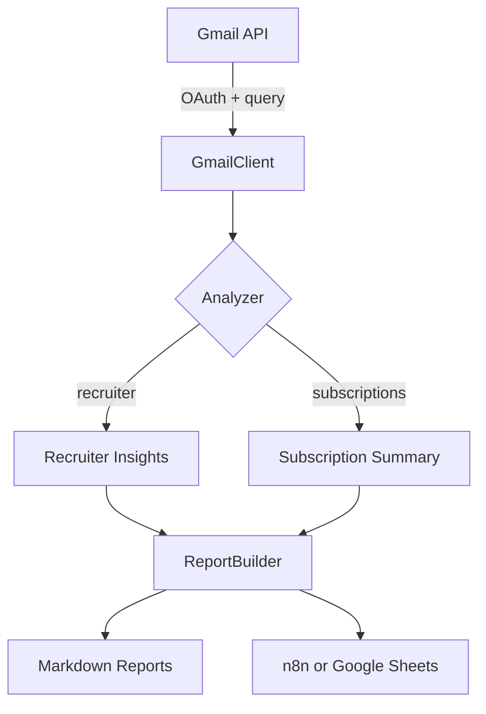

# Architecture Overview

The Email AI Assistant MVP is intentionally modular so that individual capabilities can be orchestrated through n8n or Python scripts.

## Components

1. **Data connectors** (`email_ai_assistant.gmail_client`)
   * Handles OAuth authentication against Gmail.
   * Fetches messages via configurable search queries.
   * Normalizes the payload into the `GmailMessage` dataclass.
2. **Analyzers** (`email_ai_assistant.analyzers`)
   * `recruiter` extracts recruiter-specific signals such as company names and job description links.
   * `subscriptions` aggregates message counts by sender to identify high-volume newsletters.
3. **Reporting** (`email_ai_assistant.reporting`)
   * Converts analyzer output into Markdown tables or JSON exports.
4. **Orchestration**
   * `scripts/run_mvp.py` exposes CLI commands for ad-hoc runs.
   * `workflows/*.json` demonstrates how to operationalize the same flow within n8n.

## Data flow

## Extensibility roadmap

* **Action layer** – Add modules that call the Gmail API with modify scope to archive or unsubscribe from newsletters once confidence thresholds are met.
* **Knowledge graph** – Persist recruiter interactions in a vector database for long-term memory.
* **Multi-channel** – Extend ingestion to LinkedIn messages, Slack, or SMS for holistic assistant behavior.
