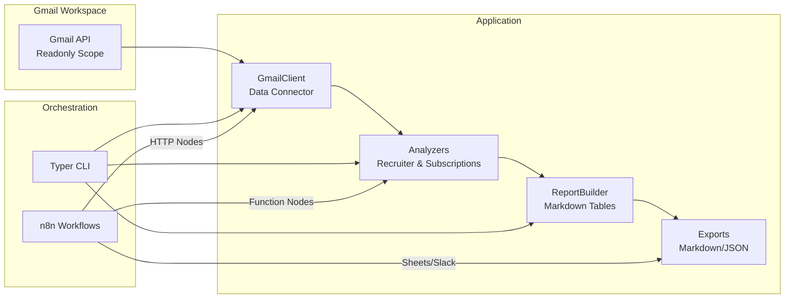

# Architecture Overview

The Email AI Assistant is organized as a thin ingestion → analysis → reporting pipeline that can run locally or be orchestrated visually through n8n.

## System Goals

- **Read-only analytics** – operate with Gmail’s read scope so onboarding is low-risk.
- **Composable insights** – separate data fetch, insight extraction, and reporting to enable future automation.
- **Workflow-first** – every capability works as a script and as a node within n8n.

## High-Level Diagram

## Layers

| Layer | Purpose | Key Modules |
| ----- | ------- | ----------- |
| **Interface** | Human entry points for running reports or automations. | `scripts/run_mvp.py`, `workflows/recruiter_insights.json` |
| **Application** | Transforms raw Gmail data into structured insights. | `email_ai_assistant.gmail_client`, `email_ai_assistant.analyzers.*`, `email_ai_assistant.reporting` |
| **Configuration** | Environment-bound settings and secrets. | `email_ai_assistant.config`, `.env` |
| **Support** | Testing, docs, operational scripts. | `tests/`, `docs/`, `scripts/` |

## Deployment Concerns

- **Credentials** – OAuth client credentials live on disk; runtime tokens are cached in `token.json`.
- **State** – Reports and exports are written to the `reports/` directory but can be redirected via CLI flags.
- **Extensibility** – Add analyzers for new use cases, or expand reporting outputs (CSV, Sheets API, etc.).

Continue with the [Component Catalog](components.md) for a detailed look at each module.
