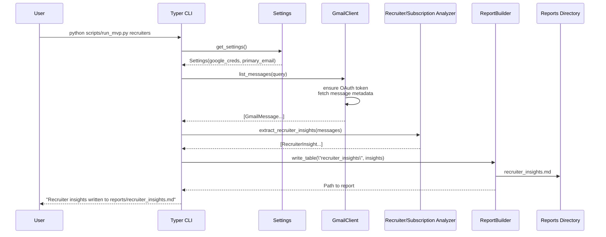

# Data Flow & Execution

This walkthrough explains how a report request moves through the system. It ties together configuration, runtime components, and outputs.

## Sequence Diagram

## Step-by-Step Breakdown

1. **Invocation** – The engineer triggers a Typer command. Equivalent workflows in n8n call the same operations via HTTP or Function nodes.
2. **Configuration Load** – `get_settings()` reads `.env`, validates the `PRIMARY_EMAIL`, and caches results for the process.
3. **Gmail Fetch** – `GmailClient.list_messages()` enforces OAuth, retrieves matching messages, and normalizes them into `GmailMessage`.
4. **Analysis** – Analyzer functions receive plain dataclasses, apply domain-specific logic (regex extraction or counting), and return insight objects.
5. **Reporting** – `ReportBuilder.write_table()` converts insights into Markdown tables and saves them under the chosen output directory.
6. **Delivery** – The CLI (or workflow) emits the final path, enabling downstream sharing (Open in editor, upload to Sheets, Slack, etc.).

## Operational Touchpoints

| Touchpoint | What To Check | Typical Issue | Resolution |
| ---------- | ------------- | ------------- | ---------- |
| `.env` | `GOOGLE_APPLICATION_CREDENTIALS`, `PRIMARY_EMAIL`, optional `OPENAI_API_KEY`. | Missing or malformed email address. | Update `.env`, rerun command. |
| OAuth Token | `token.json` in project root (or supplied path). | Token expired / refresh fails. | Delete `token.json` and rerun command to re-authenticate. |
| Output Directory | Default `reports/`. | Permission errors or stale reports. | Use `--output-dir` flag; clean up old files as needed. |
| n8n Workflow | `workflows/recruiter_insights.json`. | Credential mismatch after import. | Open n8n credentials modal and re-link Gmail & Sheets nodes. |

Proceed to the [System Introduction index](index.md) whenever you need the big picture again.
