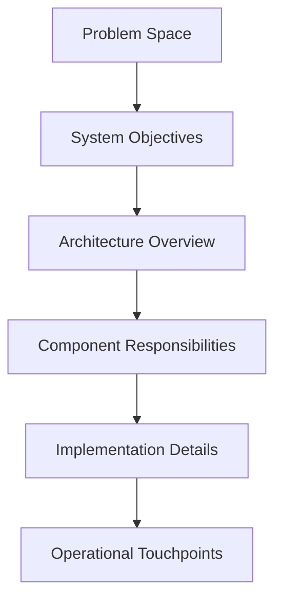

# Email AI Assistant – System Introduction

Welcome aboard! This guide gives you a top-down tour of the Email AI Assistant so you can reason about the system before touching code.

## Layered View

1. **Problem Space** – understand the business outcomes we support.
2. **System Objectives** – the measurable goals that shape technical trade-offs.
3. **Architecture Overview** – high-level structure and boundaries.
4. **Component Responsibilities** – what each building block owns.
5. **Implementation Details** – code-level layout and extension points.
6. **Operational Touchpoints** – entry points (CLI, workflows) you will use daily.

## Quick Facts

| Topic | Summary |
| ----- | ------- |
| Mission | Turn raw Gmail data into actionable recruiter and subscription insights. |
| Primary Interfaces | Typer CLI (`scripts/run_mvp.py`) and n8n workflows (`workflows/`). |
| Core Package | `src/email_ai_assistant` exposes reusable ingestion, analysis, and reporting utilities. |
| Testing | Pytest suite validating analyzers and reporting format (`tests/`). |
| Deployment | GitHub Pages friendly — the `docs/ghp` directory powers this technical introduction pack. |

## Reading Path

1. Start with [Architecture Overview](architecture.md) for system boundaries and deployment context.
2. Drill into [Component Catalog](components.md) to understand responsibilities and dependencies.
3. Explore [Data Flow & Execution](data-flow.md) for request lifecycle and operational hooks.

Move through these in order; they are designed to progressively remove layers of abstraction.
